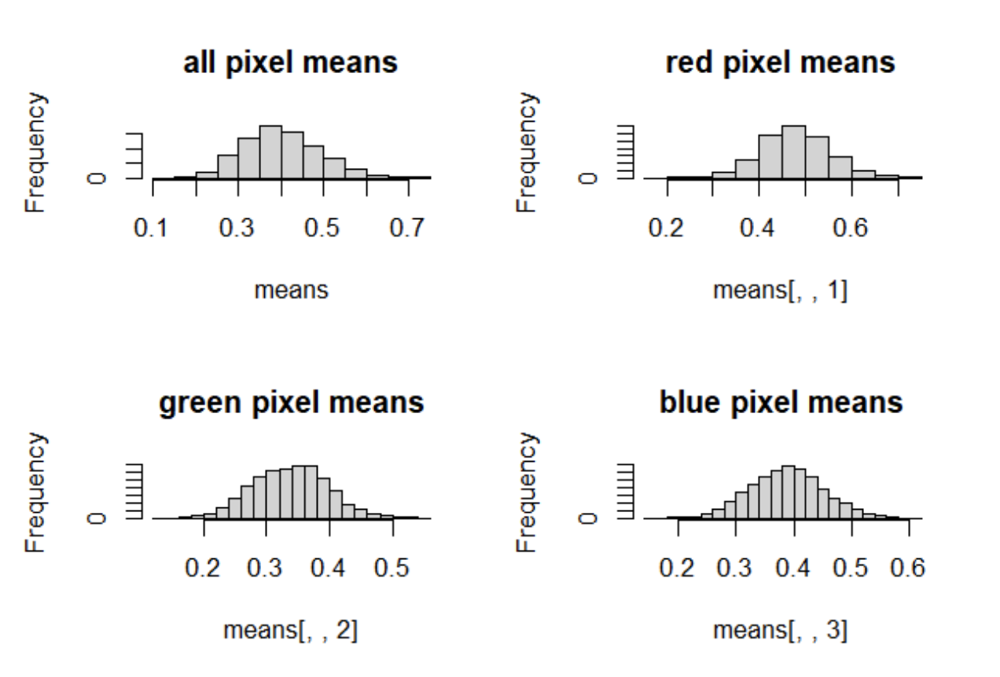
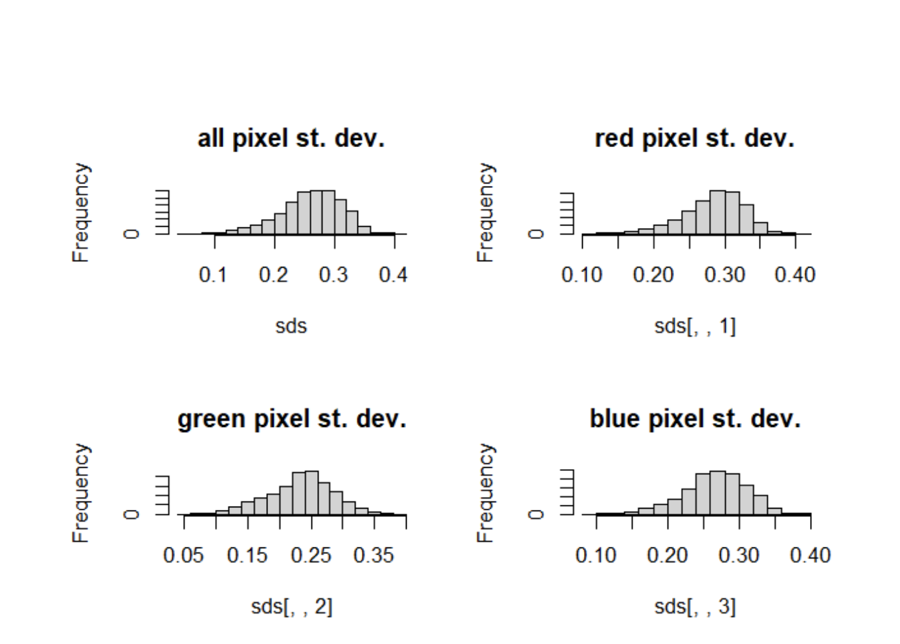

## Team members
- Garrison Bullard
- Minsoo Kang
- Leo McNicholas
- Ali Shamsulhodaey
- Winfield Warren

##Description of Dataset
The dataset “Portrait Paintings” was found on kaggle.com. The dataset consists of over 5500 portrait paintings by various artists from the years 1850 to 1950. The dataset was created by user Deewakar Chakraborty and the portraits were scrapped from WikiArt, an online, user-editable visual art encyclopedia. The dataset is a folder of JPEGs with the titles being the name of the artist. The creator only scrapped paintings that are available in the public domain to avoid copyright infringement.

## Motivation and Goals of Project 
One of the greatest examples of machine learning that is people among people is the AI Art generator. AI Art has been entertaining and we thought it would be interesting to work on a similar project that is a form of art that has been done by a machine learning model. We want to learn how a machine learning model can create art and to see if we can make it possible by using Principal Component Analysis. The goal is  to use the facial features of people and turn them into a unique style of portrait that has been drawn by artists in the past. 

## Preliminary ideas on techniques the team will apply to achieve your goals
Our first idea was to use PCA(Principal Component Analysis) and do something similar to image reconstruction. In this case, we would use a photo of the person who wants a portrait done of them and reconstruct the photo, but in a style of a portrait painting. We are still figuring out exactly how we will approach this method with reconstruction in a specific style. Our second idea is GAN(Generative Adversarial Network) which has a generator model that generates portrait paintings and tries to fool the discriminator and a discriminator model to try to detect whether that painting is man or computer made. This method would be less ideal for us as it uses Deep Learning techniques, but we plan to figure out by the next biweekly report whether we can implement and understand GAN.

### Exploratory Data Analysis:
Much of the hard work goes unnoticed here, as we had to figure out how to load very large amounts of images into R and work with them. Here are some summary plots for these images!

Average pixel value distributions across a random subsample of paintings. Red values were more highly clustered, and had higher means values than blue and green.
